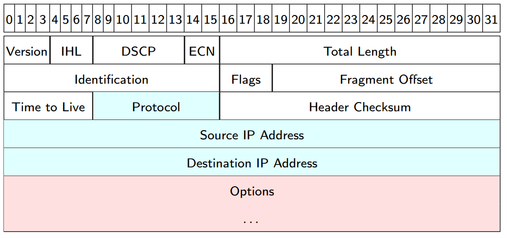
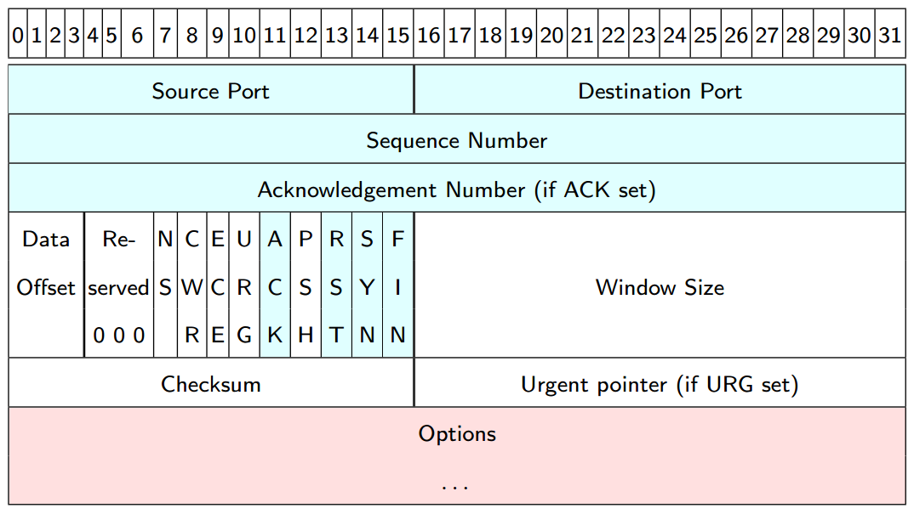
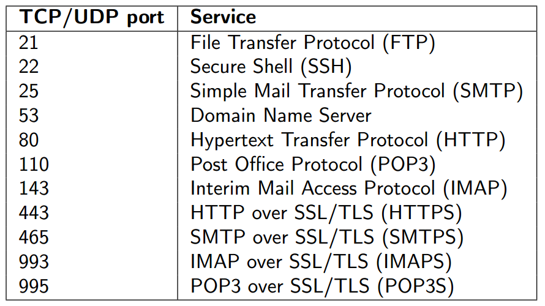
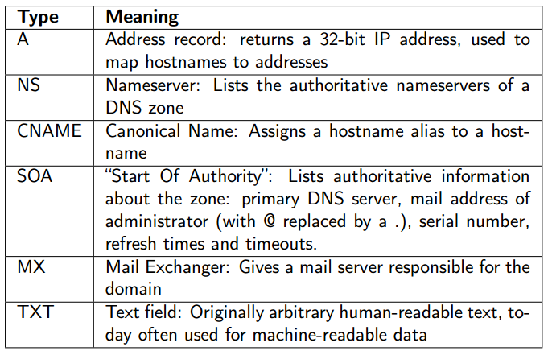
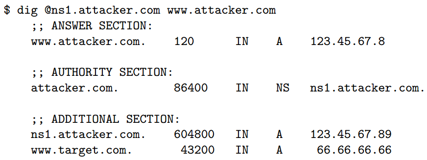
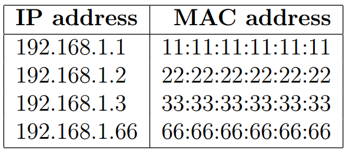
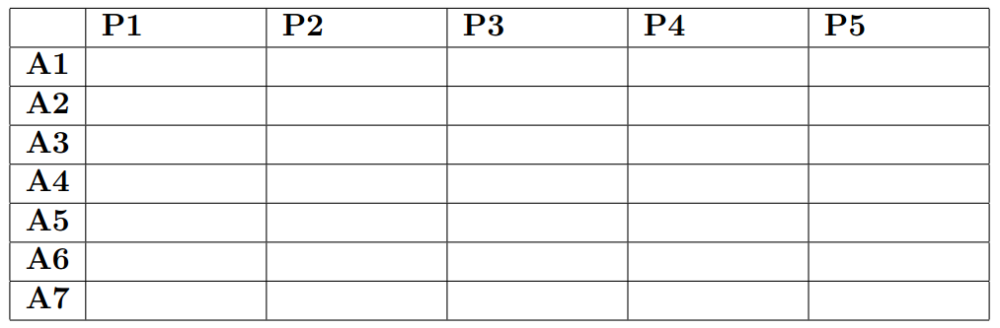

# Network Security - Exam Preparation

## Lecture 1: Security in local-area networks

* Netcat example
	* Command in tyrion: ``` netcat -lp 51966 ```
	* Command on arya: ``` echo "Hi tyrion" | netcat tyrion 51966 ```
* How does arya know tyrions IP address? -> she sends and ARP request to the broadcast MAC address (ff:ff:ff:ff:ff:ff) and gets a arp reply from tyrion with "192.168.42.1 is at 50:75.9d.f3:db:29"
* The above example is sent over a TCP/IP connection
* Network sniffing through Hubs and Switched Ethernet. Switches are aware of the MAC addresses behind their ports and do not broadcast every packet.
* **ARP Cache poisoning/ARP spoofing** still works for Switched Ethernet though
	* **Gratuitous ARP packets** are announcements ("replies without a request"). There are good reasong for this kind of announcements like announcing IP+MAC at boot time, announcing changed IP address to other hosts or ip-adress takeover in high performance clusters
* In order to use arp spoofing, IP forwarding should be enabled: ``` echo 1 > /proc/sys/net/ipv4/ip_forward ```	
* Poisoning the ARP cache of 192.168.42.2: ``` arpspoof -t 192.168.42.2 192.168.42.3 ```
* **MAC flooding**: Send many Ethernet frames with different source MAC addresses which overflows the **Content addressable memory (CAM)** of the switch
	* The effect of this depends highly on the switch itself
	* Some switches will fall back to behave like a hub 
* **ARP-attack countermeasures**:
	* static ARP table entries
	* disable gratuitous ARP (may break stuff)
	* ARP filter -> arptables
	* arpwatch
	* Protection mechanisms on advanced switches like "Dynamic ARP Inspection"
	* Protection against ARP spoofing is hard in general because ARP does not have any authentication mechanism
* **VLANs**
	* Partioning of local-area network (LAN) into multiple virtual LANs (VLANs)
	* VLANs have separated broadcast domains
	* ARP requests/replies don't go from one VLAN to another
	* Can limit the damage caused by ARP-level attacks ("students can only attack each other")		
* **MAC address filtering**
	* Switches could use a whitelist of MAC addresses and ignore computers with unknown MAC addresses
	* **MAC spoofing** is an easy way to circumvent Mac address filtering
	* ``` ip link set dev eth0 down; ip link set dev eth0 address 42:42:42:42:42:42; ip link set dev eth0 up```
* Wireless networks: **IEEE 802.11**
	* Networks are logically separated by their network names (**service set identification, SSID**)
	* Communication is physically separated by using different **channels (frequencies)**
	* Two different modes of operation: **ad-hoc mode: peer-to-peer** and **infrastructure mode: communication through access point(AP)**
* Connecting to a WiFi network
	* Connections to a wireless network are handled through **management frames**
	* Other important management frames:
		* **Reassociate request/response frames: change the AP**
		* **Disassociate frame: leave the network**
	* APs send **beacon frames** (by default, 10/second) containing:
		* Timestamp
		* Beacon interval
		* SSID
		* Frequency-hopping parameters
* **Hidden SSID**
	* Clients need to know the SSID to authenticate/associate
	* Idea: Don't send this SSID in beacon frames and advertise this as "network cloaking"
	* Network is not really cloaked, SSID is also contained in other frames
* Encrypted WiFi
	* **WEP (Wired Equivalent Privacy)** uses RC4 with 40-bit key and 24-bit IV -> weak encryption
	* RC4/WEP can be broken after 40000 frames with probability > 50% and after 85000 frames with probability > 95%
	* WEP-104 can be broken in less than a minute
	* **WPA (WiFi Protected Access)** uses **Temporal Integrity Protocol (TKIP)** which is a wrapper around RC4
	* WPA is therefore still vulnerable
	* **WPA2** got rif of RC4 and uses CCMP instead with a 128-bit AES key but sometimes provides backwards-compatibility to TKIP
	* **WPS (WiFi Protected Setup)** is still a possibility to circumvent WPA2 but is disabled but most routers


## Lecture 2: Security aspects of TCP/IP

* **4-layer IP model:**
	* Link layer
	* Internet layer
	* Transport layer
	* Application layer
* Cracking WEP: attacking physical part of link layer
* ARP spoofing: attacking logical part of link layer
* IP addresses have a **network part** and a **host part**, where hosts with the same network part are directly reachable. Access to hosts with a **different network** part needs to go through a gateway
* **Variable-length subnet masks (VLSM)**
	* Example: Netmask 255.255.255.0 means the first 3 bytes are network part. Netmask 255.224.0.0 means the first 11 bits are network part
	* Specify network together with mask: 192.168.42.0/24
* **IP Header**
* 
* **IP spoofing**: Send IP packet with wrong ("spoofed") source address
* **TCP Handshake**
* 
* **TCP ports** identify processes
* Negative answer to a **SYN** is an **RST**
* Termination of a connection uses a 4-way handshake:
	* Each side terminates independently (through a FIN)#
	* Each side acknowledges the FIN of the other side
* **TCP Header**	
* 	
* **SYN flooding**: Client sends **SYN**. Server allocates resources for connection in the SYN queue and sends **SYN/ACK** back. Client never replies back with **ACK** to the server's **SYN/ACK**. The server's **SYN queue** will fill up when sending of those SYN packets is faster than the server is "discarding" half-open connections. Time to discard is configured by the TCP SYN-Received timer.
* **SYN flooding countermeasures:**
	* Decrease the SYN-Received timer
	* Increase the size of the queue
	* Recycle oldest half-open connection
	* Firewalls
	* Better idea: SYN cookies
* **SYN cookies**	 
	* Reason for allocating resources after receiving SYN: need to remember properties of the connection
	* Idea: Securely encode this information in the server's **initial sequence number (ISN)** of SYN/ACK. Reconstruct information when ACK from client is received.
* **Ping of death**
	* Idea: target does not know how to handle malformed packets and crashes
	* IP packets are limited to a length of **65535 bytes**
	* Overlong IP packet will overflow the buffer which is used to assemble fragments
	* Trivial to exploit: ``` ping -s 65510 target ```
* **TCP session hijacking**: this became known as the "Mitnick attack" by using a DOS attack and guessing ISN.
* **Common services and their ports**: Same port for UDP and TCP (but service is not necessarily listening on both)
* 
* **Port scanning**
	* Default scan method for non-privilged user: **connect() scan**: Uses the OS's connect() system call to connect to a remote port. if connect() succeeds -> port is open, if connect() fails -> port is closed. Connect() scans appear in the servers's log files
	* **SYN scan**: Send SYN packet. If SYN/ACK is received -> port is open, if RST is received -> port is closed. Send an RST when receiving SYN/ACK to "hang up". Because the service is never completed, server does not log it.
	* **Idle scan**: More stealthy because idle scan is using a zombie host. Idle scans are based on the fragment identification number of IP packets (IPID) and that an increment of 1 means that a port is closed and an increment of 2 that the port is open.
		* Probe the zombie's IPID and record it, let's say IPID = X
		* Forge SYN packet from the zombie to the target host and port
		* Probe the zombie's IPID again, let say IPID = Y
		* Y = X + 1: port is closed
		* Y = X + 2: port is open
	* **UDP port scanning**	
		* First option: **ICMP port unreachable**
		* Second option: **Use specific service like DNS on port 53**
* **OS finderprinting**
	* Many services reveal details (e.g., banner information)		
* **Port knocking**: Hide specific services and wait for certain packets to arrive, then open port. Example: Send udp packets to port 42, 53 from a specific IP and then open port 22 for that IP.	
* **TCP Stealth**: include authentication in client's ISN


## Lecture 3: Routing and Firewalls

* **Traceroute**
	* Find out what route is used to reach a specific destination like www.google.com
	* IP header has a time-to-live (TTL) field which gets decreased by each hop by 1
	* When TTL has reached zero, an **ICMP time exceeded** is sent back
	* Traceroute send packets with incrasing TTL
	* Traceroute can use **UDP packets, ICMP echo requests (ping) or TCP SYN**
* **Routing attacks**
	* Detaching a target from the network (DOS)
	* Flooding a target with requests (DOS)
	* Becoming MitM	
* **Static routing vs Dynamic routing**	
* **Routing tables**: usage of **route** and **ip route show**	
* **Routing Information Protocol (RIP)**
* **Open Shortest Path First (OSPF)**
* **Border Gateway Protocol (BGP)**: also see "Schengen routing"
* **Scalability, Control, and Isolation on Next-Generation Networks (SCION)**: Replacement for BGP
* **Source routing**
	* **Strict source and record route (SSRR)**
	* **Loose source and record route (LSRR)*
	* Idea in both cases: The source specifies the route
* **ICMP redirect**	
	* ICMP redirects are mostly used to inform the host that a shorter route is available and can "suggest" better routes
	* Idea: Become MitM by spoofing ip of a visited host and send ICMP redirect
	* Limitations:
		* ICMP redirect will only be accepted for a route to a recently contacted host
		* 10 minutes time frame
* **Dynamic Host Configuration Protocol (DHCP)**
	* When a host enters a network it sends DHCP discovery packets and the DHCP server answers
* **Rogue DHCP**
	* Attacker can canswer DHCP requests **faster**
	* Knock clients **offline** by providing unroutable IP addresses
	* Communicate itself as default gatesway and become MitM between requesting client and the outside	
* **Firewall**: A firewall is a concept for separating networks, typically together with technical means to implement this concept.
	* Can separate networks on different levels
	* Can filter packets on the internet and transport layers
* **iptables**: A powerful linux netfilter framework to modify netfilter rules
	* iptables defines multiple **tables**, each table with multiple **chains**, each chain with multiple **rules**
	* Default table is **filter** with **3 chains**: **INPUT, FORWARD, OUTPUT**
	* Additional to rules, each of the 3 chains also has a **policy** which defines default behaviour (if no rule matches)
	* Allow ICMP echo request/reply (ping) from outside (stateless):
		* ``` iptables -A INPUT -p icmp --icmp-type echo-request -j ACCEPT ```
		* ``` iptables -A OUTPUT -p icmp --icmp-type echo-reply -j ACCEPT ```
	* Allow outbound DNS requests (stateless):
		* ``` iptables -A OUTPUT -p udp -o eth0 --dport 53 -j ACCEPT ```
		* ``` iptables -A INPUT -p udp -i eth0 --sport 53 -j ACCEPT ```	
	* iptables has multiple **modules**, use **conntrack** module for stateful firewall		
	* Allow all incoming packets that belong to established or related connection:
		* ``` iptables -A INPUT -m conntrack --ctstate RELATED, ESTABLISHED -j ACCEPT```
	* Most important connection states:
		* **NEW**: first packet of a connection
		* **ESTABLISHED**: Have seen packets of this connection before
		* **RELATED**: New connection, which is "related" to an ESTABLISHED connection
	* Enabling NAT (IP Masquerading):
		* ``` iptables -t nat -A POSTROUTING -j MASQUERADE ```	
* **Network Address Translation (NAT)**
	* Multiple hosts on a local network
	* Only one host (gateway) has an IP address routed in the Internet
	* Gateway remembers connection (IP+Port) to rewrite destination IP address on incomming packets
	* This kind of NAT is also known as **IP Masquerading**	
	* It two hosts in the local network are using the same port to connect to website like www.google.com (port 80) with source port 11111, the the gateway also rewrites the ports of these hosts		
* **Tethering:** Many (Android) phones offer sharing an Internet connection through tethering. Tethering uses NAT (IP Masquerading)
* **NAT and ICMP**
	* NAT or IP masquerading relies on ports
	* ICMP messages do not have ports
	* For ICMP echo request/reply use the **Query ID** instead of the port
* **Port forwarding**
	* The before mentioned examples are also known as **source-NAT**
	* When a server is running inside a NAT network and forwards incoming connection then it is called port forwarding or **destination NAT**
	* iptables has a **nat** table with chains: **PREROUTING, POSTROUTING, OUTPUT**	
* **Tunneling**: place packets of one protocol into the payload of another protocol
	* iptables cannot distinguish between HTTP going to port 80 and SSH going to port 80
	* **sshuttle** is a convenient tool to tunnel all traffic through SSH.
* **Proxy Servers**
	* **Application-level proxy**: understands high-level protocols, such as HTTP
	* **SOCKS proxy**: for secure forwarding of TCP connections. can be used for SSH	
	* Similar to Proxy: **Application-level gateway (ALG)**
* **Tunneling through an HTTP Proxy**
	* HTTP CONNECT() can be used to tunnel SSH through an HTTP(S) proxy	


## Lecture 4: DNS (In)security

* **Domain Name System (DNS)**: typically uses UDP on port 53
* DNS servers are typically responsible for one specific domain (DNS zone)
* Two kind of DNS servers: **recursive DNS servers** and **authoritative DNS servers**
	* **Recursive server (or DNS caches)**
		* forward requests to other servers
		* remember (cache) the reply for a certain amount of time
	* **Authoritative servers** are responsible for a certain domain (or DNS zone)
		* know the hosts in their domain
		* know the authoritative DNS server of their subdomains
* Two types of request: **recursive** and **iterative**	
	* **Recursive request (to a DNS cache)**: give me the answer or an error
	* **Iterative request (to an authoritative server)**: give me the answer or tell me who might know	
* **DNS entry types**
* 
* Four sections in a **DNS reply**:
	* **QUESTION SECTION** (repetition of the question)
	* **ANSWER SECTION**
	* **AUTHORITY SECTION**
	* **ADDITIONAL SECTION**: particularly important for glue records -> communicate IP addresses of authoritative DNS servers
* **DNS root servers**
	* Whenever a DNS server does not know the authoritative DNS servers of a Domain, it asks the DNS root servers
	* There are **13** DNS root servers
* **DNS tunneling**	
	* Tunnel SSH traffic through DNS because most of the time firewalls do not block DNS
* **DNS DDos amplification**
	* DNS answers can be much larger than the request
	* Idea: Spoof ip address of DOS victim in DNS request, victim will receive 	much more data than attacker has to send
* **DNS spoofing**
	* Send wrong answer to client: **hit one target**
	* Send wrong answer to DNS cache: **hit many targets**
	* Answers contain "validity period"	
* **DNS Cache poisoning in the old days**
* 
* **Bailiwick check**
	* Reject ADDITIONAL information if the requested server is not authorized to answer for the domain
* **Kaminsky's attack**
* **DNS Randomization**: 16bit Query ID (QID) + Source-port randomization (16bit), 0x29 randomization (random capitalization of letter in the QUESTION section)
	* Does not prevent an attack if a passive MitM is performed
* **DNSSEC**
	* Idea: Use cryptographically signed DNS entries (sign information offline)
	* Root of trust: public keys of the DNS root servers
	* Does not increase the size of DNS requests but DOES increase the size of DNS replies significantly	
	* Modern DDOS uses DNS+DNSSEC	
* **DNSCurve**	
	* Alternative to DNSSEC
	* Idea is to encrypt and authenticate DNS traffic (similar to SSL/TLS)
* **DNS zone enumeration**
	* Finding all hosts in a DNS zone is called zone numeration	

## Lecture 5: Encrypting Network Communication


## Lecture 6: Traffic Analysis and Anonymization


## Mock Exam

1. **(20 points)** Consider a switched ethernet network (all hosts connected through a single switch) with a gateway 192.168.1.1/24 and additional hosts 192.168.1.2, 192.168.1.3, and 192.168.1.66. Assume the following MAC addresses for the computers in the network:

* 	

	* a) Assume that each node has a "complete" ARP cache, i.e., each node knows the IP-address-MAC-address pairs of all other nodes. Write down all the entries in the ARP cache of 192.168.1.3

		* Answer


	* b) Assume that the attacker at IP address 192.168.1.66 runs an ARP spoofing attack to become a man in the middle between 192.168.1.1 and 192.168.1.2. Assume further that the attacker uses **ARP request spoofing** with the destination MAC address set as usual for ARP requests. What ARP request messages does the attacker have to send? Give destination IP and MAC address and source IP and MAC address for all packets.

		* Answer


	* c) What does the ARP cache of 192.168.1.3 look like after the attack? **Note:** The question is **not** about the ARP cache of one of the targets of the attack!

		* Answer


	* d) How could 192.168.1.2 have prevented the attack?

		* Answer


2. **(20 points)** Consider again the network from exercise 1. Assume that a new computer joins that network (by plugging in a cable and booting up). Assume that this new computer does not know anything about the network and attempts to learn the network configuration via DHCP.

	* a) What pieces of information does the new computer need to receive via DHCP so that the user can fire up a browser, enter http://wikipedia.com in the address bar and the website of wikipedia.com actually loads?

		* Answer

	* b) Assume that an attacker with IP address 192.168.1.66 sets up a rogue DHCP server to become a man in the middle between the new computer and wikipedia.com. Which of the pieces of information from part a) could he modify to become a man in the middle? What information would he send? How would the attack proceed (if there are any further steps required)? Give all possibilities for an attack.

		* Answer
	

	* c) Why could a rogue-DHCP attack fail? What possibilities does an attacker have to increase the chances of success?

		* Answer


3. **(20 points)** For each of the following three different port scan types

	* connect scan, 
	* SYN scan,
	* idle scan

	answer the following questions:

	* a) How does it work? What packets are being sent to probe whether the port is open, what answer packet(s) are expected if the port is open, what answer packet(s) are expected if it's closed?

		* Answer

	* b) The scans are listed in increasing order of "stealthiness". Explain briefly why this is the case by explaining how a system administrator could notice those scans and attribute their origin.
	
		* Answer


4. **(20 points)** Consider the following iptables firewall script running on a laptop called **mylaptop**:

	* ```
		iptables -F
		iptables -P INPUT DROP
		iptables -P OUTPUT DROP
		iptables -P FORWARD DROP
		iptables -A OUTPUT -p tcp --dport 22 -j ACCEPT
		iptables -A OUTPUT -p tcp --dport 80 -j ACCEPT
		iptables -A OUTPUT -p tcp --dport 443 -j ACCEPT
		iptables -A OUTPUT -p icmp --icmp-type echo-request -j ACCEPT
		iptables -A INPUT -m conntrack --ctstate RELATED,ESTABLISHED -j ACCEPT

	For each of the following tasks decide whether the firewall allows it or not. If the firewall does not allow it, give an iptables rule that enables it. In each part you can assume the presence of additional rules from the previous parts. **Note:** The rules have to be minimal and must not allow anything beyond the required functionality; in particular something like **iptables -P INPUT ACCEPT** is not a valid solution.

	* a) A web browser running on mylaptop tries to load the website at https://www.google.com

		* Answer

	* b) The user runs the ping utility on my laptop to test whether the host www.ru.nl is reachable.
	
		* Answer

	* c) A mail client on mylaptop retrieves e-mail from post.science.ru.nl through IMAPS (TCP port 993)
	
		* Answer

	* d) Another computer (not the laptop with the firewall) uses the ping utility to test whether mylaptop is reachable.

		* Answer

	* e) Somebody else from outside tries to connect to the SSH server running on port 22 of mylaptop.
	
		* Answer


5. **(20 points)** Consider a confidential e-mail being sent from a user A (using e-mail provider P_A) to another user B (using e-mail provider P_B). Consider the following independent cryptographic protections for this e-mail communication:

	* P1: User A is in a WPA2-protected WiFi using pre-shared keys.
	* P2: User A uses TLS to communicate with the SMTP server of P_A.
	* P3: User B uses TLS to communicate with the IMAP server of P_B.
	* P4: Provider P_A and P_B communicate through IPSec with encapsulated security payloads (ESP) in tunnel mode.
	* P5: User A obtains B's PGP public key from pgp.mit.edu and then encrypts the e-mail using PGP with this public key.

	Consider the following attacks against this e-mail communication:

	* A1: An attacker, who is not the in WiFi network that A is in, sniffs the WiFi traffic near A to read the e-mail.
	* A2: An attacker, who is in the WiFi network that A is in, sniffs the WiFi traffic to read the e-mail
	* A3: An attacker, who is in the same network that B is in, sniffs the network to read the e-mail.
	* A4: An attacker (controlling an Internet router) sniffs the traffic between A and the SMTP server of P_A.
	* A5: An attacker (controlling an Internet router) sniffs the traffic between P_A and P_B.
	* A6: A's provider is reading and analyzing the e-mail.
	* A7: B's provider is reading and analyzing the e-mail.			

	* a) Fill in a checkmark in each cell of the following table, if and only if the cryptographic protection alone is effective to prevent the attack:

		* 

		**Note:** Don't forget to submit this sheet together with your exam or copy the table to your exam sheet.

		* Answer

	* b) Can you think of an attack that would work against each of the protections (and any combination of those)?
	
		* Answer		


